## WebDoh Framework in Todo App as Demo

Today everyone is using Javascript frameworks to build webapp, the frameworks such as React, Vue or Angular which we use them for every JS projects and we are amazed by magic they present to us at the same time, but we kind of never know how the magics are made from, because these frameworks are only designed for usages not for understanding how it works, as user or developer you don't need to understand them before you can use, however, even you want to understand the magic you have been performing from the frameworks, they are still way too hard to learn it.
While using the tools, you may have questions marks in head why the view can be rendered if some data is updated. Why once the properties of a child component are changed by its parent then the view of the child can be updated and so on and on. Can we perform this kind of magic on my own application with native Javascript and other libraries other than the frameworks. However there is no clue still and no entry point to start learn about it to answer your questions.

Now this repo here as a framework as well as a demo of a Todo webapp, is here to open the door in front of you for your questions in your mind. WebDoh is a data-driven webcomponent based with virtual DOM rendering framework to build single page web application. The framework as library is super light weight which is production ready but more for education in order to explain how the modern Javascript web frameworks like React, Vue or Angular work to structure component with views driven by data.

### How the branches in this repo work for your understanding

In this repo, an demo app Todo App is built on this framework, there are two branches in this repo, one is the `main` another is `no-vdom`, the `main` is built with virtual DOM but `no-vdom` does not use virtual DOM to manipulate and render DOM elements, it uses jQuery to manipulate DOM instead. The purpose to have two approach to build the app with the exactly same feature and outcome is to compare them head to head and explain what value virtual DOM can bring and help engineering the code by literally simplifying the code structure. Another branch `shadowdom` just head to head compare it to `main` branch with real DOM, what is the difference brought to the app if we use built in shadow DOM offered from native web component, leaving out a question whether is worthy doing that for the users. Therefore, we should starting looking into the branches in this order and learning the magics step by step:

1. `no-vdom`: Use native webcomponent as a base to wrap component logic, with the native hooks offered from webcomponent, we can render template to populate the DOM and react to attributes changes. Focus on how react data(which is powered by native JS `Proxy`) works with related template rendering and how the changes on webcomponent attributes trigger react data then template rendering. How we can register webcomponent method as event handlers from the templates.
2. `main(ie. vdom)`: Introduced vdom rendering and patching/updating vdom, we no longer to attach specific render function to the react data but rendering the whole template with vdom( patching).
   Without virtual rendering we have to have specific render callback attached to each react data:

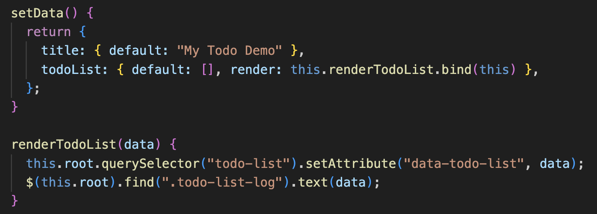
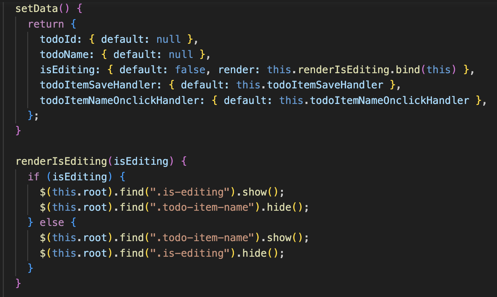

Now we can see with virtual dom rendering, specific render callbacks are no longer needed which are handled by virtual dom for patching update.

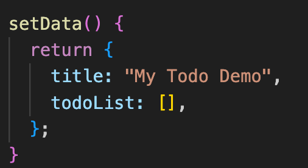
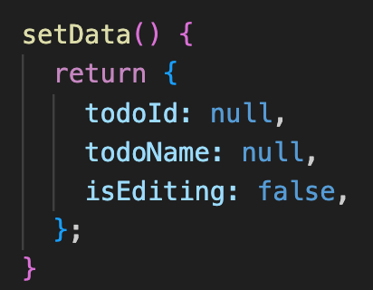

During creating the vdom from template, we can take advantage to attach event handler and dom element to webcomponent methods and `refs` property, which make it behave more like what we see in React/Vue.

3. `shadowdom`: We only replace the real DOM rendering with shadow DOM, however, as shadow DOM is completely encapsulated from the outside styles, no global css/style can be applied to each shadow DOM, meaning we have to literally load/import styles to each of webcomponent every time, a global css library like `bootstrap` has to be loaded by each webcomponent if each of them wants to take styles from this library, worthy or not is your judgment.

### Why this Framework can behave like React/VueJs but in a very simple way

WebDoh uses most of the native JS/HTML features and simple libraries as:

- Native webcomponent: It contains object `constructor` and `lifecyle hooks` to render html(`connectedCallback`) and react on component attributes changes(`attributeChangedCallback`)
- Javascript `Proxy`: to create react data with hooks to invoke callback function once the data is updated.
- Underscore template library: a light weight template render library as a function to convert html template with Javascript embedded with `<% %>` markup, data as parameters will be injected into the template and render. It is used by WebDoh to output html string from template string with data input, Javascript as `map`, `if/then`, `JSON` can be executed, so it is like JSX to render html and Javascript but the library won't parse the template to pick up DOM event handler like `onclick` or `onchange` but WebDoh goes for the native way to attach a global function to the DOM event, without parsing the template, WebDoh will go for a way under the hook to register the handler from the webcomponent method `listeners()` to become a global functions which are attached to the DOM event handler by native Javascript. With this approach, a sophisticated parser in templating is saved for simplicity which both works and good for learning and understanding(Education purpose).
- Custom library in functions as minimal as possible to just create virtual DOM from html string and compare/patch between virtual DOMs. Simple enough to read and understand them.

### Architecture

1. Webcomponent base is the parent object of your webcomponent extends from which wraps up properties, data and life cycle hooks. Two hooks are very crucial and they have been used in this app.

   `connectedCallback`: It is like onLoad or onMount hooks when you can populate the html to the webcomponent.

   `attributeChangedCallback`: It reacts to the attributes changes on the webcomponent, you attach callback action to the specific attribute changes, normally we update react data here which drives the rendering. That is how the `prop-drill` becomes possible in the modern frameworks.

   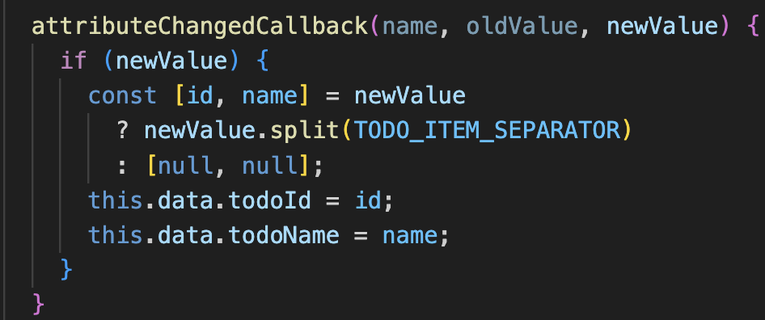

   `beforeMount`, `beforeRender`, `afterRender` and `init` are lifecycle hooks which are set up for your webcompoent to use.

2. React data is the data has been monitored with changes then executes a registered callback function. The react data is made by native Javascript object [`Proxy`](https://developer.mozilla.org/en-US/docs/Web/JavaScript/Reference/Global_Objects/Proxy). We create local react data in the `data` method (similar to Vue), all react data here are local data like the states by useState in React. However, we have set/get service to push local data to the global level which is similar as `Redux store` or `React Context` in global state sense. All modern framework is data-driven that means the view or html changes are driven by data changes. We create We should only change data but never manipulate the html manually after the render functions are attached to the react data as callback. In `no-vdom`, without vdom, we have to specific attach callback function to each data, in the callback, we uses jQuery the DOM manipulate library to create and update the DOM. This functions are invoked by the change on the specific data. If we switch to `main`, we will be amazed by what the virtual dom library which is to create and update can do for you, "No more messy specific render callback" because rendering is triggered by any of data changes, the code is so clean now. Virtual dom library unifies all of logic of rendering a template, it creates a new virtual dom by the current updated data and compared with the previous virtual dom cached in the webcomponent, then it loops through each DOM to compare it one by one, if a difference is found, it patches the difference only, otherwise it will use the new virtual dom that can create new DOM or remove old ones.

3. Register DOM event handler and element: Without `Vdom` library to pickup handler from DOM and register the webcomponent method as the event handler, in `no-vdom` branch, we have to attach webcomponent method as the window/global functions which can be invoke by the DOM event. However, we need to create hash value and attach the global functions to make them unique.
   Create hashed function names:

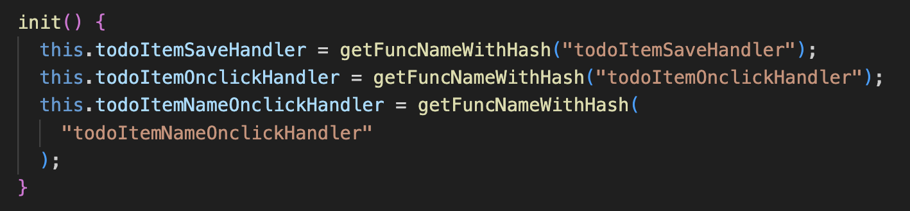

Register them as event handlers:

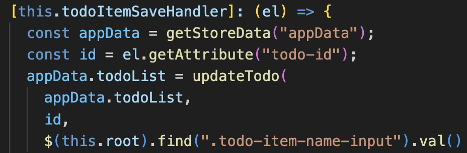

With the help from `Vdom` virtual dom rendering, we can have the way for our listeners like the modern frameworks.

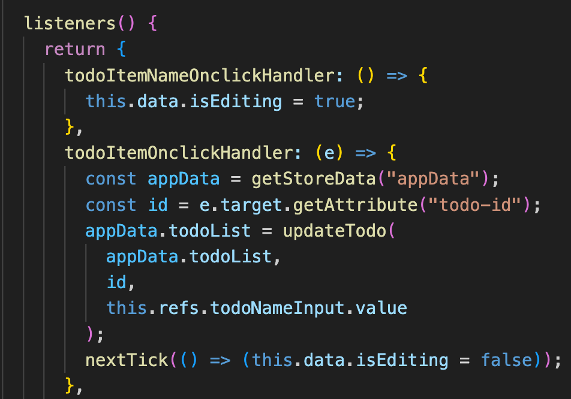

### How to create your app with WebDoh framework/library

1. Extend `baseComponent` from `@webdoh` to create your own custom webcomponent.

2. Focus on hooks like `beforeMount` to push your local react data to global context which you can get it back anywhere for manipulation:

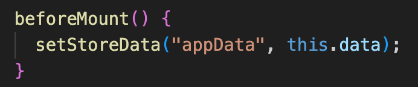

3. Set the react local data for webcomponent in `setData()`:

4. Create the template with template markups which executed as JS in `template()`:

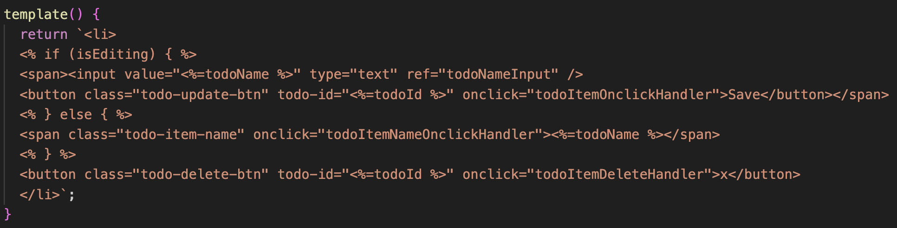

5. Register the DOM event handlers in `listeners()`:

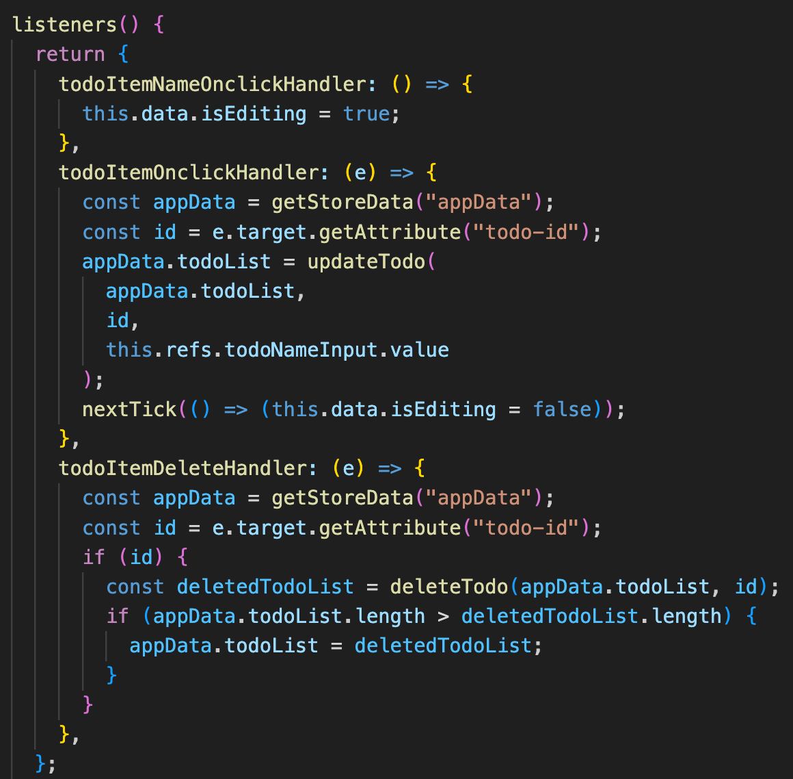

6. Write the attributesChanged callback in `attributesChangedCallback()` to react to the webcomponent changes:

7. Last but not least is to define/register your webcomponent as a custom tag:

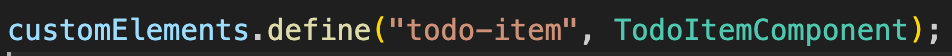

### How to run

This repo is designed to maximise the usage of native/vanilla Javascript without depending any 3rd libraries or frameworks, so we are using Javascript `modules` and VsCode `LiveServer` plugin/extension instead of `Webpack`. After the LiveServer extension is installed. You can simply right click on the `index.html` and select `Open with Live Server`.
Open `localhost:8888` to see the app in action and have fun!
