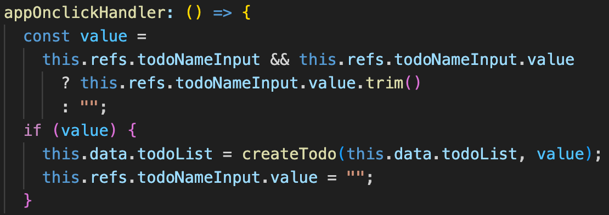

## WebDoh Framework in Todo App as Demo

##### Nowadays everyone is using Javascript frameworks to build web apps, who does not use modern JS frameworks like React, Vue, Angular or Svelte? We just simply use them for every JS projects and we are amazed by the magic they present to us at the same time. However we kind of NEVER know and understand how the magics are made from, because these frameworks are only designed for usages not for understanding of how it works. As a user or developer you just don't need to understand them before you can use them, but even you want to understand the magic you have been performing, they are still a way too hard to be learnt.

While using the frameworks as tools, you may already have Questions marks in head about why the view could be driven the data, how the global state store works, how Prop-drill could drive rendering, how could the templating works with DOM event handlers and as an element and so on and on. Can we ever perform this kind of magic to work as an web app with the most native JS and minimal libraries which are simple and understandable. Here mentioned are all valid questions and interesting desire from a passionate JS developer.

Now this repo here as a framework/library(`WebDoh`) as well as a Demo of a `Todo App`, it is opening the door and leading to the answers of your questions in mind. `WebDoh` is a Data-driven native `Webcomponent` based framework/library with virtual DOM rendering to build single page web applications. The framework as library is super light weight, which is production ready but more for Education in order to explain how the modern JS web frameworks like what we have been using today, work to structure components with views driven by data.

### How the branches in this repo work for your understanding

In this repo, a demo app `Todo App` is built on this framework, there are two branches in this repo. One is the `main`, another is `no-vdom`. The `main` is built with virtual DOM but `no-vdom` does not use virtual DOM to manipulate and render DOM elements, it uses `jQuery` to manipulate DOM insteads. The purpose to have two approaches to build the same app with the exactly same features and behaviours is to compare both head to head and explain what value the virtual DOM can bring and help engineering the code by literally simplifying the code structure. Another branch `shadowdom` just head to head compare it to `main` branch with real DOM, what is the difference brought to the app if we use built in shadow DOM offered from native webcomponent, leaving out a question whether is beneficial to use shadow DOM.

Therefore, we should starting looking into the branches in this order and learning the magics step by step:

1. `no-vdom`: Use native webcomponent as a base to wrap component logic, with the native hooks offered from webcomponent, we can render template to populate the DOM and react to attributes changes. Focus on how react/responsive data(which is powered by native JS [`Proxy`](https://developer.mozilla.org/en-US/docs/Web/JavaScript/Reference/Global_Objects/Proxy)) works with template rendering and how the changes on webcomponent attributes trigger react data then rendering template. How we can register webcomponent method as event handlers from the templates.

2. `main(ie. vdom)`: Introduced `Vdom` rendering and patching/updating virtual DOM. We no longer attach specific render function to the react data but rendering the whole template with `Vdom`(render/patch).
   Without virtual dom rendering we have to have specific render callback attached to each react data:

Now we can see with virtual DOM rendering, specific render callbacks are no longer needed but they are handled by virtual DOM for patching update.

During creating the virtual DOM from template, we can take advantage to attach event handler and DOM element to webcomponent methods and `refs` property, which make it behave more like what we see in React/Vue.

3. `shadowdom`: We only replace the real DOM rendering with shadow DOM, however, as shadow DOM is completely encapsulated from the outside styles, no global css/style can be applied to each shadow DOM, meaning we have to literally load/import styles to each of webcomponent every time, a global css library like `bootstrap` has to be loaded by each webcomponent if each of them wants to take styles from this library, worthy or not is your judgment.

### Why this Framework can behave like React/VueJs but in a very simple way

`WebDoh` uses most of the native JS/HTML features and simple libraries as:

- Native webcomponent: It contains object `constructor` and `lifecyle hooks` to render html(`connectedCallback`) and react on component attributes changes(`attributeChangedCallback`)
- Javascript `Proxy`: to create react data with hooks to invoke callback function once the data is updated.
- Underscore template library: a light weight template render library as a function to convert html template with Javascript embedded with `<% %>` markup, data as parameters will be injected into the template and render. It is used by `WebDoh` to output html string from template content with data input. Native JS syntax as `map`, `if/then`, `JSON` can be executed, so it is like JSX to render html and JS but the library won't parse the template to pick up DOM event handler like `onclick` or `onchange` but `WebDoh` goes under the hook to register the handler from the webcomponent method `listeners()` to become a global functions which are attached to the DOM event handler by native JS. But in `main` during the virtual DOM rendered and updated, we can simply pick up DOM attributes as event like `onclick/onchange` and attached webcomponent listeners methods with the same name to a DOM, which is working like a parser in JSX but very readable and simple way, good for understanding for Education.
- Custom library in functions as minimal as possible to just create virtual DOM from html string and compare/patch between virtual DOMs. Simple enough to read and understand them.

### Architecture

1. `baseWebcomponent` is the parent object of your webcomponent to extend from which wraps up properties, data and life cycle hooks. Two hooks are very crucial and they have been used in this app.

   `connectedCallback`: It is like `onLoad` or `onMount` hooks when you can populate the html to the webcomponent.

   `attributeChangedCallback`: It reacts to the attributes changes on the webcomponent, you attach callback action to the specific attribute changes, normally we update react data here which drives the rendering. That is how the `Prop-drill` becomes possible in the modern frameworks.

   

   `beforeMount`, `beforeRender`, `afterRender` and `init` are lifecycle hooks which are set up for your webcomponent to use.

2. React data is the data has been monitored with changes then executes a registered callback function. The react data is made by native JS object [`Proxy`](https://developer.mozilla.org/en-US/docs/Web/JavaScript/Reference/Global_Objects/Proxy). We create local react data in the `data` method (similar to Vue), all react data here are local data like the states by `useState` in React. However, we have set/get service to push local data to the global level which is similar as `Redux store` or `React Context API` in global state sense. All modern framework is data-driven that means the view or html changes are driven by data changes. In `no-vdom`, without virtual DOM, we have to specific attach callback function to each data, in the callback, we uses `jQuery` the DOM manipulate library to create and update the DOM. This functions are invoked by the change on the specific data. If we switch to `main`, we will be amazed by what the virtual DOM library which is to create and update the difference after comparing two virtual DOMs, that can do for you. `"No more messy specific render callback!!!"` because virtual DOM rendering is triggered by any of data changes and the virtual DOM updating is just like the specific render does in `no-vdom`, only update the difference, never never never overwrite the whole local html/DOM(if so it will lose the current state of the DOM like `focus` on `<input>`) , the code is so clean now!
   Virtual dom library unifies all of logic of rendering a template, it creates a new virtual dom by the current updated data and compared with the previous virtual DOM cached in the webcomponent, then it loops through each DOM to compare it one by one, if a difference is found, it patches the difference only, otherwise it will use the new virtual DOM that creates new DOM or removes the old one.

3. Register DOM event handler and element: Without `Vdom` library to pickup handler from DOM and register the webcomponent method as the event handler, in `no-vdom` branch, we have to attach webcomponent method as the window/global functions which can be invoke by the DOM event. However, we need to create hash value and attach the global functions to make them unique.
   Create hashed function names:

Register them as event handlers:

With the help from `Vdom` virtual DOM rendering, we can have the way for our listeners like the modern frameworks.

### How to create your app with WebDoh framework/library

1. Extend `baseComponent` from `@webdoh` to create your own custom webcomponent.

2. Focus on hooks like `beforeMount` to push your local react data to global context which you can get it back anywhere for manipulation:

3. Set the react local data for webcomponent in `setData()`:

4. Create the template with template markups which executed as JS in `template()`:

5. Register the DOM event handlers in `listeners()`:

6. Write the callback for attribute changes in `attributesChangedCallback()` to react to the webcomponent changes:

7. Last but not least is to define/register your webcomponent as a custom tag:

### How to run

This repo is designed to maximise the usage of native/vanilla JS without depending any 3rd libraries or frameworks, so we are using Javascript `modules` and VsCode `LiveServer` plugin/extension instead of `Webpack`. After the LiveServer extension is installed. You can simply right click on the `index.html` and select `Open with Live Server`.
Open `localhost:8888` to see the app in action and have fun!
